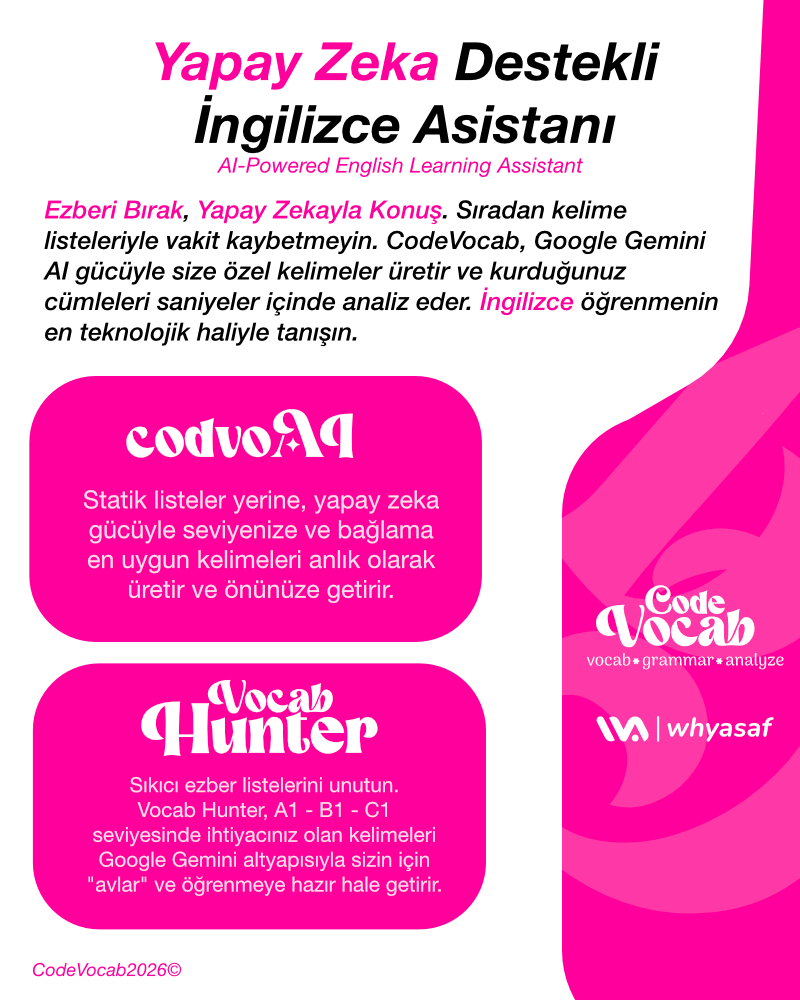
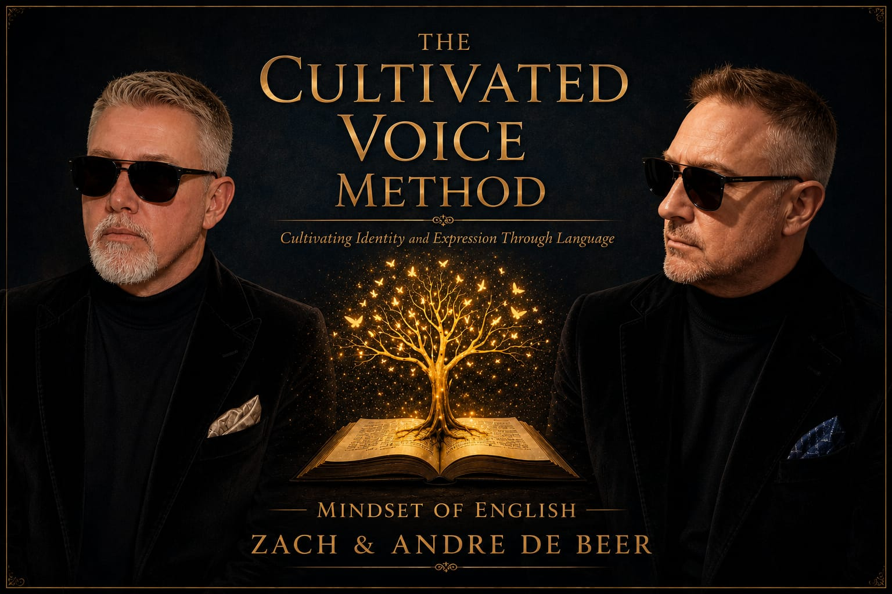
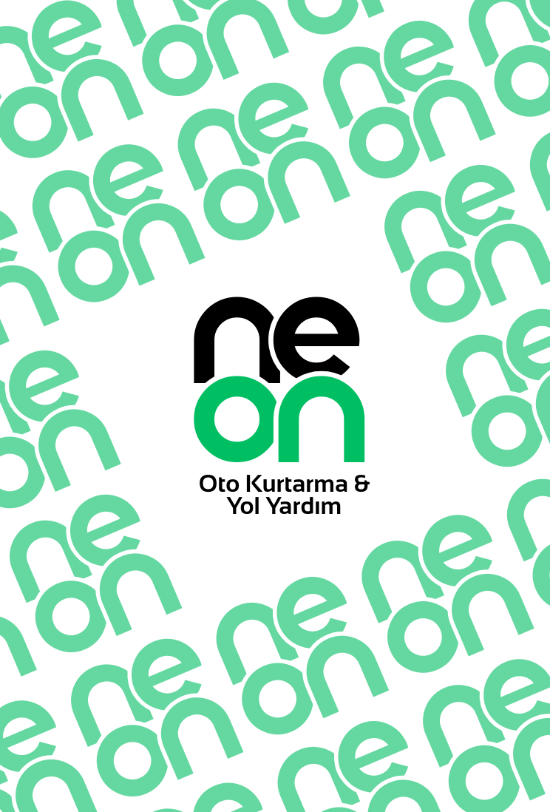
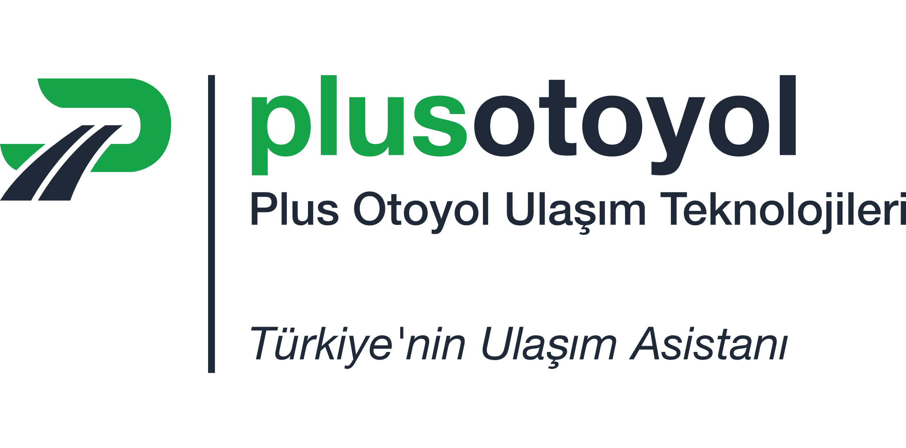

<p align="center">
  <picture>
    <source media="(prefers-color-scheme: dark)" srcset="public/assets/wa-kurumsal-light.png">
    <source media="(prefers-color-scheme: light)" srcset="public/assets/wa-kurumsal.png">
    
  </picture>
</p>

<h1 align="center">whyasaf.com</h1>

<p align="center">
  <b>Yazılım Mimarisi • Ürün Tasarımı • Yapay Zeka Entegrasyonları</b><br />
  <i>"Algoritmalarla geleceği tahmin etme, estetikle onu baştan tasarla."</i>
</p>

<p align="center">
  <a href="https://whyasaf.com"></a>
  <a href="https://x.com/whyasaf"></a>
  <a href="https://www.linkedin.com/in/omer-asaf-ak/"></a>
</p>

---

## Hakkımda & Vizyon

Merhaba, ben **Ömer Asaf Ak (whyasaf)**. İstanbul merkezli **Ürün Geliştirici (Product Developer)** ve **Sistem Mimarısı (Systems Architect)** adayıyım.

Yazılım geliştirme süreçlerinde **teknik mimariyi estetik tasarım prensipleriyle** harmanlıyorum. Bir projenin sadece "çalışması" yeterli değildir; arka planda sağlam, sürdürülebilir bir kod yapısına ve ön planda kullanıcıyı etkileyen kusursuz, minimalist bir arayüze sahip olması gerekir.

- **İstanbul Üniversitesi (2024—2026):** Bilgisayar Programcılığı — Makine Öğrenmesi & Sistem Analizi
- **CodeVocab AI (2025—Günümüz):** Kurucu & Geliştirici — Doğal Dil İşleme (NLP) ve AI Destekli Kodlama
- **Marki Corp. (2022—Günümüz):** Kurucu & Product Developer — Bağımsız Dijital Ürün Stüdyosu

---

## Portfolyo & Öne Çıkan Projeler

### 1. CodeVocab AI

<p align="center">
  
</p>

- **Kategori:** Yapay Zeka / NLP / İngilizce Öğrenim Platformu
- **Bağlantılar:** [Live Site](https://codevocab.whyasaf.com) • [GitHub Repository](https://github.com/whyasaf/CodeVocab)
- **Özet:** İngilizce çalışırken _"Acaba bu cümleyi doğru mu kurdum?"_ ikilemini bitiren platform. Doğal dil işleme (NLP) ve yapay zeka modelleriyle teknik ve genel cümle yapılarını anında analiz eder.

### 2. Cultivated Voice System (CVS)

<p align="center">
  
</p>

- **Kategori:** Akademik & Profesyonel İngilizce Eğitim Sistemi
- **Bağlantılar:** [Live Site](https://www.cultivatedvoicesystem.com/) • [GitHub Repository](https://github.com/whyasaf)
- **Özet:** Doğru akademik çalışma, özgüvenli iletişim ve etkili İngilizce konuşma becerileri (IELTS, PTE, TOEFL) için tasarlanmış sistemli öğretim modeli.

### 3. Neon Oto Kurtarma

<p align="center">
  
</p>

- **Kategori:** Kurumsal Web Sitesi & Marka Kimliği
- **Bağlantılar:** [Live Site](https://neonotokurtarma.com) • [Instagram](https://www.instagram.com/neonotokurtarma) • [YouTube](https://www.youtube.com/@neonotokurtarma) • [TikTok](https://www.tiktok.com/@neonotokurtarma)
- **Özet:** Neon Oto Kurtarma için özel olarak kurgulanan kurumsal kimlik, logo tasarımı ve modern web sitesi projesi.

### 4. Plus Otoyol

<p align="center">
  
</p>

- **Kategori:** Ulaşım Teknolojileri & Rota Mimarisi
- **Bağlantılar:** [Live Site](https://plusotoyol.com) • [GitHub Repository](https://github.com/whyasaf)
- **Özet:** Türkiye genelindeki yolculuk deneyimini geliştirmek amacıyla tasarlanan platform. Rota planlama, mola noktaları, otoyol ve ücret bilgileri ile akaryakıt verilerini tek bir merkezde toplar.

---

## Blog & Düşünce Notları

Sitede yayınlanan ve teknoloji, finans ile sistem tasarımı üzerine odaklanan derinlemesine makaleler:

1. **Kontrol Bizde mi, Yoksa Sadece Öyle mi Sanıyoruz?**
   - _Süper Yapay Zeka (ASI), Zeka Patlaması ve Hizalama Sorunu üzerine sistem analizi._
2. **Mark Zuckerberg Bir Banka Kursaydı Ne Olurdu?**
   - _MetaBank konsepti: Devasa müşteri ağı, sıfır bürokrasi ve devlet egemenliği arasındaki finansal çatışma._
3. **110 Milyar Dolar: Bir Yatırım mı, Yoksa Geleceğin Satın Alınması mı?**
   - _Devasa sermaye akışları ve küresel teknoloji yatırımlarının analizi._
4. **Kod Yazmaktan Fazlası: Problem Çözme Sanatı**
   - _Yazılım geliştirmede sentaksın ötesine geçip sistem mimarı gibi düşünebilmek._
5. **SpaceX Halka Arzı: Bir Yatırım Fırsatından Fazlası**
   - _Uzay ekonomisi, Starlink ve küresel finans piyasaları üzerindeki etkileri._

---

## Öne Çıkan Mimari & Animasyon Özellikleri

Sitede yer alan ve özel olarak geliştirilen etkileşimli bileşenler:

### 1. 3D İnteraktif Not Defteri (Blog Footer)

- **Spine-Anchored Pivot:** Defter sırtına (`originX: 0` / `originX: 1`) sabitlenmiş dönüş ekseni.
- **Double-Sided 3D Pages:** `backface-visibility: hidden` ve `preserve-3d` kullanarak sayfa çevrilirken ön/arka yüz içeriğinin kusursuz geçiş yapması.
- **Dynamic Sweep Shadows:** Sayfa dönüş açısına göre yumuşak gölge katmanlarının hareket etmesi.

### 2. AutoCAD Kinetic Typography (Projeler Footer)

- **AutoCAD Crosshair Tracker:** İmlecin konumunu algılayan canlı koordinat indikatörleri (`X`, `Y`).
- **Dynamic Grid Ticks:** Hover olunduğunda ölçeklenen köşe `+` çizgi işaretleri ve teknik çizim sınırları.
- **Parallax Kinetic Text:** İmleç vektörüne göre hafifçe kayan tipografi haritası.

### 3. Dinamik Tema & Medya Duyarlı Favicon

- **Anti-Flash Script:** Sayfa yüklenirken beyaz ekran sıçramasını (flash) önleyen yerel saklama kontrolü.
- **Media-Query Favicon:** Kullanıcının sistem temasına göre (Light / Dark) otomatik değişen koyu/açık ikonlar (`wa-favicon.png` & `wa-favicon-light.png`).

---

## Teknik Altyapı & Teknolojiler

- **Framework:** Next.js 14 (App Router)
- **Dil:** TypeScript, React 18
- **Stil & Tasarım System:** Tailwind CSS, Vanilla CSS, Responsive Layout
- **Animasyon Mimarısı:** Framer Motion
- **İkonografi:** Lucide React, Custom SVG
- **Çoklu Dil (i18n):** Özel `LanguageContext` altyapısı (Türkçe & İngilizce)
- **SEO & Semantik HTML:** Person JSON-LD, OpenGraph, Dynamic Sitemap (`sitemap.ts`) ve Robots (`robots.ts`)

---

## Dosya ve Proje Dizini

```text
whyasaf_websayt/
├── app/                      # Next.js App Router Yapısı
│   ├── about/                # Hakkımda Sayfası
│   ├── blog/                 # Blog Liste & [slug] Detay Sayfaları
│   ├── projects/             # Projeler Sayfası
│   ├── globals.css           # Küresel CSS ve Tema Stil Tanımları
│   ├── layout.tsx            # Ana Düzen (Metadata, Fontlar & Favicon)
│   ├── page.tsx              # Anasayfa (Bio & Seçkiler)
│   ├── robots.ts             # Dinamik Robots.txt
│   └── sitemap.ts            # Dinamik Sitemap.xml
├── public/
│   └── assets/               # Proje Görselleri, Videolar ve Logolar
│       ├── codevocab.mp4     # CodeVocab Demo Videosu
│       ├── cv.png            # CodeVocab Kapak Görseli
│       ├── plusotoyolresmi.png # Plus Otoyol Görseli
│       ├── neon.png          # Neon Oto Kurtarma Görseli
│       ├── wa-favicon.png    # Koyu Favicon
│       └── wa-favicon-light.png # Açık Favicon
└── src/
    ├── components/           # UI Bileşenleri (ProjectsGrid, Footer, HeroSection)
    ├── context/              # Dil ve Tema Context Yapıları
    ├── data/                 # Blog İçerik Veritabanı (posts.ts)
    └── lib/                  # Çeviri Sözlüğü (translations.ts)
```

---

<p align="center">
  Designed & Developed by <b>Ömer Asaf Ak (whyasaf)</b>
</p>
